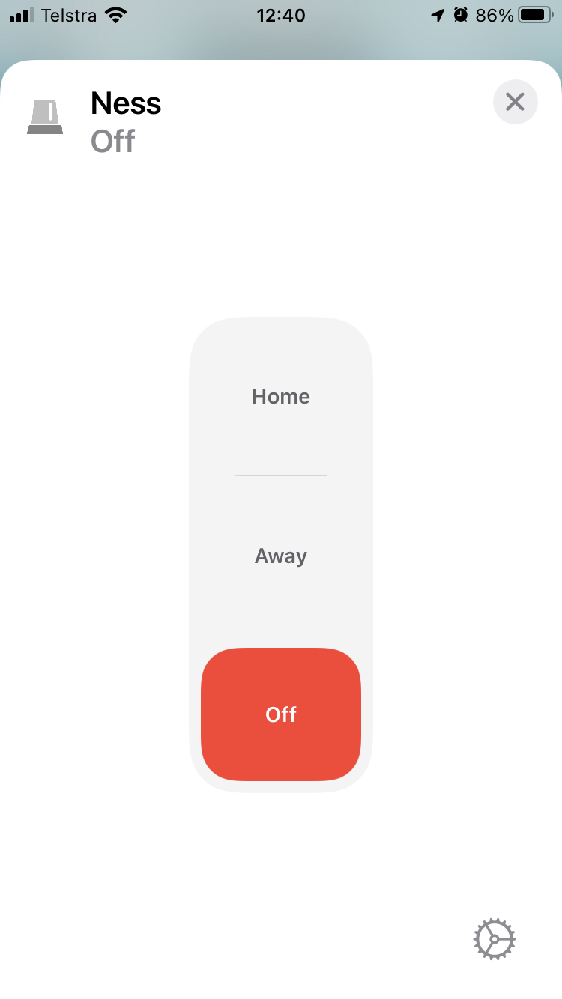
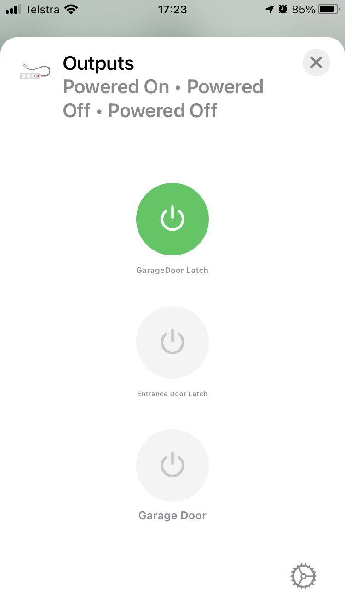

# homebridge-ness-d16x

[](https://www.npmjs.com/package/homebridge-ness-d16x) 
[](https://codecov.io/gh/anekol/homebridge-ness-d16x)
[](https://github.com/homebridge/homebridge/wiki/Verified-Plugins)

A Homebridge plugin to support the Ness D8x / D16x Security Panel and zone accessories.

* Mode mapping
  
  | Homebridge | Ness          |
  | ---------- | ------------- |
  | Home       | Armed Home    |
  | Away       | Armed Away    |
  | Night      | Not Supported |
  | Off        | Disarmed      |

* Be aware that if Ness Home/Monitor Mode is not configured on your panel and you don't exclude mode "Home" in your settings, then selecting Away followed by Home will NOT disarm the panel (Off will).

* AUX Outputs are modelled as "Outlets". Turn On/Off, behaviour is determined by panel setup (eg see P141E 4E/P141E 8E for AUX1 enabled/disabled/toggle/latch )

<a href="readme/panel.png"></a>
<a href="readme/outputs.png"></a>

## Installation

### Hardware Interface

Requires an interface that supports [Ness D8x / D16x Serial Interface ASCII protocol](http://www.nesscorporation.com/Software/Ness_D8-D16_ASCII_protocol_rev13.pdf) eg.

* [Usriot USR-TCP232-302](https://www.pusr.com/download/M0/USR-TCP232-302-User-Manual_V1.0.3.01.pdf)
* [Ness IP232](https://ness.zendesk.com/hc/en-us/articles/360019149433-101-244-IP232-Module)
  

### Homebridge

Use the Homebridge UI homebridge-config-ui-x UI Plugins/Config or from the shell.

```sh
$ npm install homebridge-ness-d16x --save
```

## Support and Issues

* For support please use the [Discussions](https://github.com/anekol/homebridge-ness-d16x/discussions) tab.

* Please use the Issues [Issues](https://github.com/anekol/homebridge-ness-d16x/issues) tracker only for:
  + Proposing/discussing development/enhancement issues
  + Submitting pull requests
  + Bug reports - where a bug is either a _demonstrable problem_ that is caused by the code in the repository, 
or missing, unclear, or misleading documentation. Good bug reports are very welcome - thank you!
